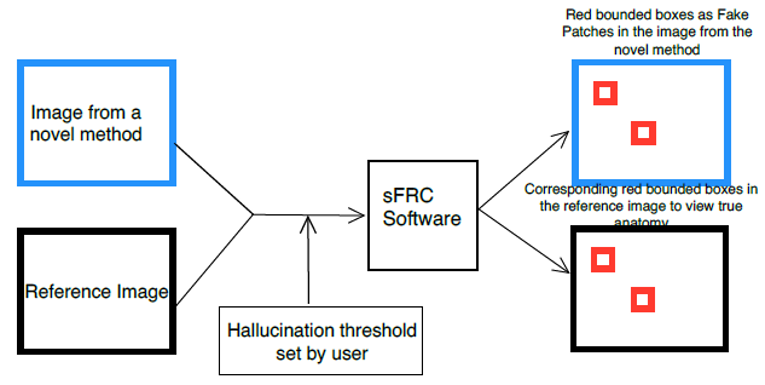
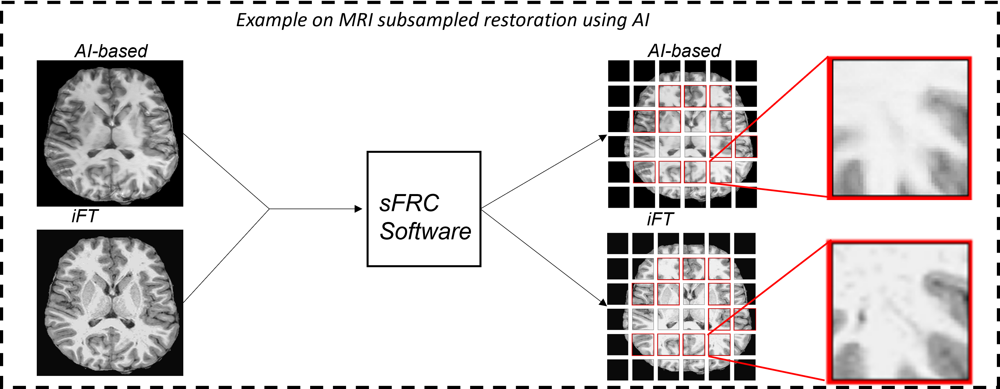

sFRC for detecting fakes in medical image restoration 
========================================================================================================================
**sFRC** scans and performs Fourier Ring Correlation (FRC)-based analysis over small patches between images from AI-assisted methods and their reference counterparts to objectively and automatically identify fakes as detailed in our 
`sFRC paper <10.36227/techrxiv.171259560.02243347/v1>`_. You can also perform sFRC analysis to find fakes from iterative regularization-based methods by simply comparing images from regularization-based vs. reference methods. 

.. raw:: html

    

- **Inputs**: Restored medical images from Deep learning- or Iterative regularization-based methods and their reference counterparts from the standard-of-care methods (such as FBP), and hallucination threshold.

.. raw:: html
   
   

*Fig 1: An illustration of inputs to sFRC as test images from novel methods (such as AI or Iterative (IRT)-based) and reference methods (such as physics-based), and hallucination threshold. The figure also depicts outputs as red-bounding boxes on images from the novel and reference methods to indicate fake patches and actual anatomy in the corresponding reference patches.* 

.. raw:: html

   

- **Outputs**: Small-sized red bounding boxes on input images that are deemed as fake ROIs (in AI-assisted as well as reference images), and the total number of such fake ROIs in the provided input images.
  These ROIs as red bounded box indicate that those regions have not been faithfully reconstructed. They may exhibit imaging errors that are readily non-discernible fakes to human eyes. Some of the 
  fakes/hallucination observed in our study include over-smoothing, in-homogeneity, tiny structural changes, removal of subtle features/signals, distortion of small organelles, addition of minute 
  indentation-/blood vessel-/plaque-like structures, coalescing of small organelles, unwarranted foldings, contrast migration anomaly etc. 
  
  A gif-based illustration on sFRC-based output – on SRGAN (left) and sharp-FBP (right) images  – using 20 image pairs from the sFRC paper for the CT super-resolution problem is provided above. 
  Movie files on sFRC-labeled fakes for the entire CT test set is provided `here <https://fdahhs.ent.box.com/s/vvfcbqxd66a2x09yld1tyk2weqs72i7s>`_.

.. raw:: html
   
   

*Fig 2:  Red bounding boxes as outputs from sFRC. The bounding boxes on an AI-based and an inverse Fourier Transform (iFT)-based images indicate fakes detected by sFRC and corresponding reference anatomy. The AI-based image was restored from subsampled MRI data acquired using an acceleration factor of three (i.e., using only 33% of raw measurement data). The reference image was restored using physics-based inverse Fourier transform on the fully sampled data (i.e., using 100% of raw measurement data). A zoomed view of a pair of patches indicates removal of the dark signal in AI-based image as compared to its reference iFT patch.*

.. raw:: html

   

- **Demo**: On two image restoration problems: CT super-resolution (**ct_superresolution**), and MRI sub-sampling (**mr_subsampling**).

|
.. contents::

|

Usage
-----

.. code-block::

    $ main.py [-h] --input-folder INPUT_FOLDER [--output-folder OUTPUT_FOLDER] [--patch-size PATCH_SIZE] [--random_N]
              [--input-gen-folder INPUT_GEN_FOLDER] [--target-gen-folder TARGET_GEN_FOLDER] [--img-format IMG_FORMAT] 
              [--multi-patients] [--remove-edge-padding] [--apply-hann] [--frc-threshold FRC_THRESHOLD] [--inscribed-rings] 
              [--anaRing] [--rNx RNX] [--rNy RNY] --in-dtype IN_DTYPE [--save-patched-subplots] [--apply-bm3d] [--mtf-space]
              [--dx DX] [--ht HT] [--windowing WINDOWING] [--remove-ref-noise] [--img-y-padding]

    sFRC analysis between image pairs from DL(or Reg)- & reference-based methods to identify fake artifacts
    
    arguments:
    -h, --help            show this help message and exit
    --input-folder        directory name containing images.
    --output-folder       output folder to save bounding box-based fake labels on DL/Reg & reference image pairs, and sFRC plots.
    --patch-size          p96 or p64 or 48 or p32 to indicate patch sizes for the sFRC analysis. Change padding option in main.py for a
                          different patch size.
    --random_N            performs sfrc calculation on randomly selected 16 complimentary images from DL/Reg - Reference folders.
                          For more info refer to in-built options in main.py.
    --input-gen-folder    folder name containing DL or regularization method-based outputs.
    --target-gen-folder   folder name containing reference method-based outputs.
    --img-format          image format for input and target images. Dicom/raw/tif/png? To add a new image format read function look 
                          inside the function partition_read_n_sfrc_plot_n_calc in file mpi_utils.py.
    --multi-patients      if there are multiple-subfolders related to different parents.
    --remove-edge-padding remove patches at the edges of images when mod(img size, patch size) != 0.
    --apply-hann          apply hanning filter before the frc calculation.
    --frc-threshold       frc threshold to determine correlation cut-off between the 2 methods. This patch-based FRC analysis
                          is better suited with a constant threshold such as 0.5, 0.75. Other common options include half-bit, all,
                          one-bit. To add new threshold, look inside function FRC in the file frc_utils.py.
    --inscribed-rings     max frequency at which correlation is calculated is img (or patch) length/2. if false then frc will be
                          calculated upto the corner of the image (or patch).
    --anaRing             perimeter of circle-based calculation to determine data points in each ring. Otherwise, no. of pixels in
                          each ring used to determine data points in each ring.
    --rNx RNX             image x-size for raw image as input.
    --rNy RNY             image y-size for raw image as input. Default is same dim as rNx
    --in-dtype            data type of input images. It is needed for images with .raw filenames. It is also needed to set the maximum 
                          intensity value for air thresholding and windowing of patches when saving bounding box-based outputs.
    --save-patched-subplots
                          if you want to save patches with the bounding box and FRC plot results.
    --apply-bm3d          apply image-based mild bm3d smoothing before the frc calculation. It decreases the chance of quick FRC
                          drop. which means it increases the chance of missing fake artifacts. But it has advantage of increasing PPV.
    --mtf-space           x-axis for FRC is in the mtf space. Uses the dx info. Use this option only if you have info on dx for your
                          acquisition. Otherwise, do not use this option. When this option is not used, x-axis for FRC has unit pixel(^-1).
    --dx                  xy plane pixel spacing. Default value is set from the LDGC dataset and has the unit mm.
    --ht                  patches whose x-coordinates (corresponding to the points when their FRC curves intersect with the frc-
                          threshold) that fall below this ht threshold will be labeled as fake ROIs.
    --windowing           windowing used when generating the patched subplots Options include soft, lung, bone, unity and none.
                          Setting appropriate viewing window is very important in zeroing anomalies between a DL method- and
                          reference method-based outputs. For a sanity check, you may choose to confirm the marked ROIs generated
                          from this implementation by using software like ImageJ under different type of windowing.
    --remove-ref-noise    applies a gentle bilateral filtering to reference images.
    --img-y-padding       pads y-dim with zeros with pad_width=(rNx-rNy). It is useful when analyzing coronal-slices.

Requirements
------------
Install `openmpi <https://www.open-mpi.org/>`_ if your machine does not have one. A guide is provided in the file
./requirements/openmpi_setup.txt. Export paths related to openmpi's compilers and libraries 
as your environment variable as follows:

.. code-block::
     
     $ export PATH=$HOME/path/to/openmpi/bin:$PATH
     $ export LD_LIBRARY_PATH=$HOME/path/to/openmpi/lib:$LD_LIBRARY_PATH
     
Create a new conda enviroment and install the required packages as follows:

.. code-block::
    
    $ conda create -n mpi_sfrc python=3.7.5 --no-default-packages
    $ conda activate mpi_sfrc
    $ conda install -c anaconda h5py==3.6.0 # other h5py versions may incur memory leak
    # to install packages for performing sFRC-based calculations
    $ pip install -r ./requirements/sfrc_requirements.txt
    # to install packages to perform CT super-resolution and MRI reconstruction
    $ pip install -r ./requirements/im_recon_requirements.txt 

DEMO execution of sFRC
----------------------------------------------------------
The example codes below show how to run sfrc by using data from DL/Reg methods and their reference counterparts used in the `sFRC paper <10.36227/techrxiv.171259560.02243347/v1>`_. 
Run the codes below. Then accordingly change input paths and sfrc parameters for your application. 

1. sFRC on SRGAN-based CT upsampled (x4) images

   .. code-block::
      
      OUTPUT_FNAME="./results/CT/sm_srgan_tune_sh_L067/"
      INPUT_FOLDER="./ct_superresolution/results/test_sh_L067/ua_ll_smSRGAN_tune_in_x4/checkpoint-generator-20/"
      INPUT_GEN="test_sh_L067_cnn"
      TARGET_GEN="test_sh_L067_gt"
      mpirun --mca btl ^openib -np 1 python main.py --input-folder ${INPUT_FOLDER} --output-folder ${OUTPUT_FNAME} --patch-size 'p64'  --input-gen-folder ${INPUT_GEN} --target-gen-folder ${TARGET_GEN} --img-format 'raw' --frc-threshold '0.5' --in-dtype 'uint16' --anaRing --inscribed-rings --rNx 512 --apply-hann --mtf-space --ht 0.33 --windowing 'soft' --save-patched-subplots
   
   OR execute the demo bash file
   
   .. code-block:: 
      
      bash +x demo_sfrc_run.sh 'CT' 'tune' 'sh' 1

   'CT' indicates sFRC applied on CT-based data. 'sh' and 'tune' are options to indicate paths for sharp kernel-based data and 
   tuning set for sFRC parameters used in the `sFRC paper <10.36227/techrxiv.171259560.02243347/v1>`_. Likewise 'sm' indicates smooth kernel-based test set. 
   1 indicates one processing unit (-np) to be used in our mpi-based sFRC implementation. 
   Note that, in this git repo, the demo example for the CT application includes only 5 CT images. 
   As such, the no. of fakes, for the specified parameters, for sharp and smooth data will be 21 
   and 16 respectively. Refer to the next subsection to fetch the complete test set and results as 
   provided in the sFRC paper for the CT application. 

2. sFRC on UNet- and PLSTV-based MRI outputs from a subsampled acquisition (x3)

   .. code-block::
      
      bash +x demo_sfrc_run.sh 'MRI' 'test' 'unet' 4

   Change the third option to 'plstv' for the plstv-based results provided in the `sFRC paper <10.36227/techrxiv.171259560.02243347/v1>`_. 

Apply trained SRGAN 
--------------------
The SRGAN checkpoint provided in this repository was trained using CT images from the six patients provided in 
`LDGC dataset <https://wiki.cancerimagingarchive.net/pages/viewpage.action?pageId=52758026>`_ and as detailed in the sFRC paper.
This checkpoint can be applied to the low-resolution CT images provided in this repository to upscale them by a factor of 4
in the following manner: 

3. Apply SRGAN on tuning set

   .. code-block:: 

      cd ct_superresolution
      bash +x demo_srgan_test.sh 'tune' 'sh' #on sharp kernel-based tuning set

To apply the SRGAN to all the CT images from patient L067 (as described in the sFRC paper) refer to "./ct_superresolution/create_sr_dataset/readme.txt".
Once you successfully download and preprocess smooth and sharp CT scans corresponding to patient L067, the following commands will 
yield fake patches as tabulated in TABLE I in the `sFRC paper <10.36227/techrxiv.171259560.02243347/v1>`_ and as depicted in the following 
`movie files <https://fdahhs.ent.box.com/s/vvfcbqxd66a2x09yld1tyk2weqs72i7s>`_.

4. Apply SRGAN on test set

   .. code-block:: 

      cd ct_superresolution
      bash +x demo_srgan_test.sh 'test' 'sh'
      bash +x demo_srgan_test.sh 'test' 'sm'

Then set the first command line input as 'test' to indicate tags related to the paths 
of CT images are test set for the sFRC analysis (as used in the `sFRC paper <10.36227/techrxiv.171259560.02243347/v1>`_) when executing demo_sfrc_run.sh.

5. sFRC on SRGAN-based CT upsampled (x4) test images (sharp as well as smooth)

   .. code-block:: 

      cd ..
      bash +x demo_sfrc_run.sh 'CT' 'test' 'sh' 47 # on sharp test data with 47 set as no. of processors
      bash +x demo_sfrc_run.sh 'CT' 'test' 'sm' 47 #on smooth test data with 47 set as the no. of processors

Apply trained UNet 
-------------------
The trained Unet model and data provided in this repository (as well as used in the `sFRC paper <10.36227/techrxiv.171259560.02243347/v1>`_) have been imported from the following github
repository: `hallucinations-tomo-recon <https://github.com/comp-imaging-sci/hallucinations-tomo-recon>`_. Also, 
`Pediatric epilepsy resection MRI dataset <https://kilthub.cmu.edu/articles/dataset/Pediatric_epilepsy_resection_MRI_dataset/9856205>`_ is 
the original source of the MRI data. 

6. Apply Unet on MRI test set

   .. code-block:: 
   
      cd mr_subsampling/unet
      bash +x run_unet_test.sh
      cd ..

PLSTV-based reconstruction 
-------------------------------
Follow the installation instructions provided in the `BART repository <https://mrirecon.github.io/bart/>`_.
Then edit the path to BART's python wrapper in line 20 in file "./mr_subsampling/plstv/bart_pls_tv.py".

7. Apply PLSTV on MRI test set

   .. code-block:: 

      cd plstv
      bash +x run_bart_pls_tv.sh

References 
----------
1. McCollough, Cynthia H., et al. "Low‐dose CT for the detection and classification of metastatic liver lesions: results of the 2016 low dose CT grand challenge." Medical physics 44.10 (2017): e339-e352.

2. Bhadra, Sayantan, et al. "On hallucinations in tomographic image reconstruction." IEEE transactions on medical imaging 40.11 (2021): 3249-3260.

3. Ledig, Christian, et al. "Photo-realistic single image super-resolution using a generative adversarial network." Proceedings of the IEEE conference on computer vision and pattern recognition. 2017.

4. Sergeev, Alexander, and Mike Del Balso. "Horovod: fast and easy distributed deep learning in TensorFlow." arXiv preprint arXiv:1802.05799 (2018).

5. Uecker, Martin, et al. "The BART toolbox for computational magnetic resonance imaging." Proc Intl Soc Magn Reson Med. Vol. 24. 2016.

6. Maallo, Anne Margarette S., et al. "Effects of unilateral cortical resection of the visual cortex on bilateral human white matter." NeuroImage 207 (2020): 116345.

7. Maallo, Anne; Liu, Tina; Freud, Erez; Patterson, Christina; Behrmann, Marlene (2019). Pediatric epilepsy resection MRI dataset. Carnegie Mellon University. Dataset. https://doi.org/10.1184/R1/9856205.

License and Copyright
---------------------------
mpi_sfrc is distributed under the MIT license. See `LICENSE <https://github.com/DIDSR/mpi_sfrc/blob/master/LICENSE>`_ for more information.

Citation
--------
Please cite sFRC if it helped your research work

::

   @article{kc2024fake,
     title={Fake detection in AI-assisted image recovery using scanning Fourier Ring Correlation (sFRC)},
     author={Kc, Prabhat and Zeng, Rongping and Soni, Nirmal and Badano, Aldo},
     journal={TechRxiv Preprints},
     year={2024},
     doi={10.36227/techrxiv.171259560.02243347/v1},
   }

Contact
--------
prabhat.kc@fda.hhs.gov
