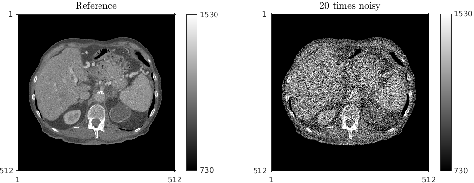
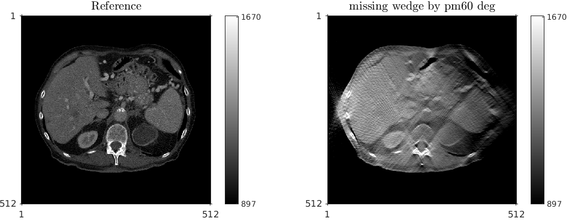
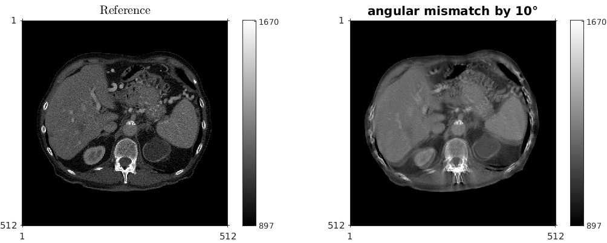
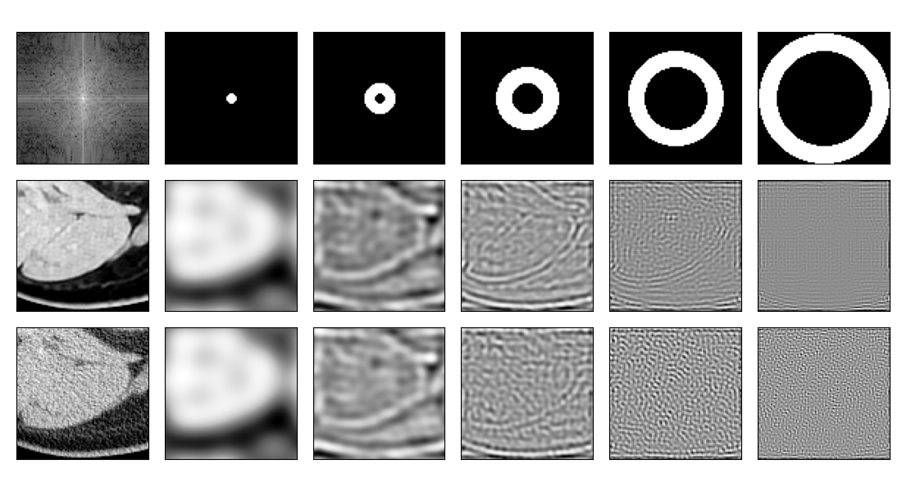
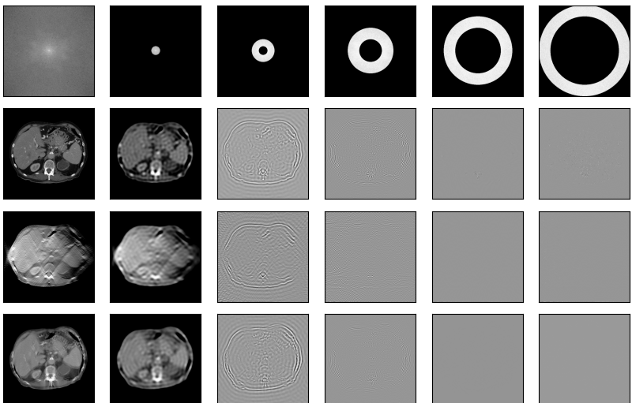

Downloads
---------
Running subroutines found in this folder, in turn, require functions found in the irt package.
Following are the steps to add irt to your matlab path:

.. code-block:: bash

    $ cd conventional_artifacts
    $ wget https://github.com/smuzd/LD-CT-simulation/blob/master/I0.mat?raw=true
    $ mv I0.mat\?raw\=true I0.mat
    $ mv I0* ./data/ 
    $ wget https://web.eecs.umich.edu/~fessler/irt/fessler.tgz
    $ tar -xvzf fessler.tgz
    $ mv src/fbp2_window.m irt/fbp/
    $ cd conventional_artifact/irt
    $ matlab 
    >> setup
    >> cd ..

Simulate the Noise Artifact shown in the supplemental information in our `sFRC paper <https://doi.org/10.36227/techrxiv.171259560.02243347/v2>`_
---------------------------------------------------------------------------------------------------------------------------------------------------
.. code-block:: matlab

    noise_artifact

Simulate the Missing Wedge Artifact shown in the supplemental information in our `sFRC paper <https://doi.org/10.36227/techrxiv.171259560.02243347/v2>`_
---------------------------------------------------------------------------------------------------------------------------------------------------------

.. code-block:: matlab

    missing_wedge

change the missing wedge angle inside the matlab file

Simulate the Distortion Artifact shown in the supplemental information in our `sFRC paper <https://doi.org/10.36227/techrxiv.171259560.02243347/v2>`_
---------------------------------------------------------------------------------------------------------------------------------------------------------

.. code-block:: matlab

    distortion_artifact

Simulate the Blurring Artifact shown in the supplemental information in our `sFRC paper <https://doi.org/10.36227/techrxiv.171259560.02243347/v2>`_
------------------------------------------------------------------------------------------------------------------------------------------------------

.. code-block:: python

    python blurring_artifact.py

Get the banded plots as shown in main and supplemental paper in our `sFRC paper <https://doi.org/10.36227/techrxiv.171259560.02243347/v2>`_
----------------------------------------------------------------------------------------------------------------------------------------------

.. code-block:: python

    python banded_plots_4rm_uint16.py

re-set the crop_fig option as False in the banded_plots_4rm_uint16 file

